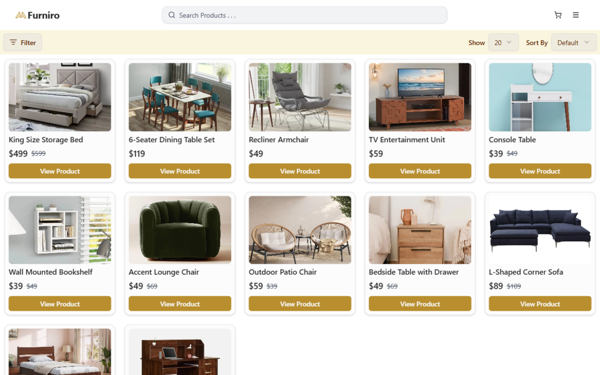
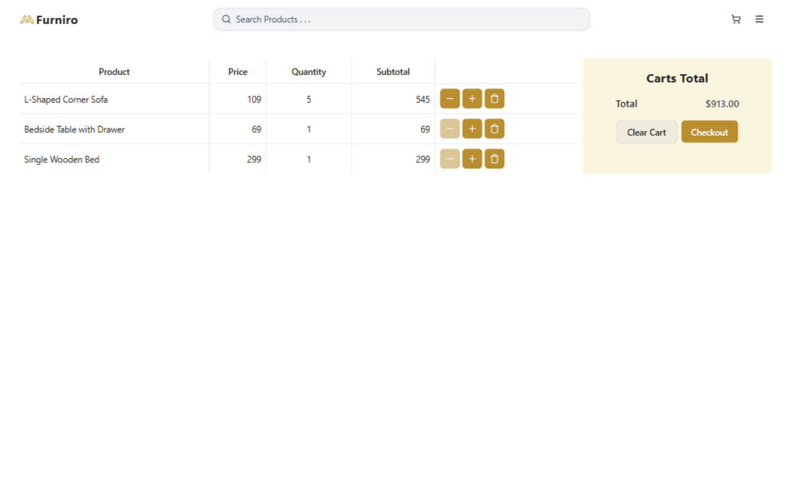
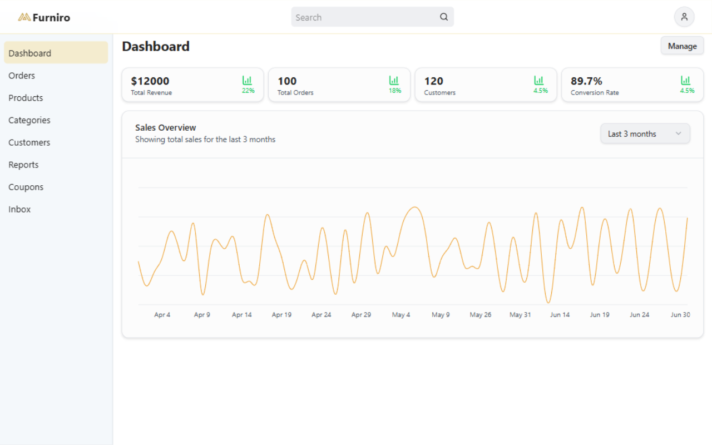

# 🛋️ Furniro – Full Stack E‑commerce Application

Furniro is a **full‑stack e‑commerce web application** built with modern web technologies. It supports user authentication, product browsing with advanced filtering, cart and order management, and an admin dashboard for managing products and orders.

This project demonstrates a complete real‑world e‑commerce workflow using **Next.js App Router** and **Node.js + Express**.

---

## 🚀 Features

### 👤 User Features

- User authentication (Register / Login)
- Email verification using Brevo
- Browse products with filters
- Add to cart and manage cart items
- Place orders (dummy checkout)
- Responsive design for all devices

### 🛠️ Admin Features

- Admin dashboard
- Product management (create, update, delete)
- Order management
- Image upload using Cloudinary

---

## 🧰 Tech Stack

### Frontend

- **Next.js** (App Router)
- **Tailwind CSS**
- **shadcn/ui**
- **Zustand** (state management)

### Backend

- **Node.js**
- **Express.js**
- **MongoDB** (Mongoose)
- **JWT Authentication**
- **Brevo** (email verification)
- **Cloudinary** (image uploads)

---

## 🔐 Environment Variables

### Frontend (`.env`)

```env
NEXT_PUBLIC_API_URL=http://localhost:8000/api
```

### Backend (`.env`)

```env
NODE_ENV=
PORT=8000
MONGODB_URI=
JWT_SECRET=

FRONTEND_URL=http://localhost:3000

CLOUDINARY_CLOUD_NAME=
CLOUDINARY_API_KEY=
CLOUDINARY_API_SECRET=

BREVO_API_KEY=
EMAIL_USER=
```

---

## ▶️ Getting Started

### 1️⃣ Clone the Repository

```bash
git clone https://github.com/mdshakerullahS/Furniro.git
cd furniro
```

---

### 2️⃣ Backend Setup

```bash
cd backend
npm install
npm run dev
```

Backend will run on:

```
http://localhost:8000
```

---

### 3️⃣ Frontend Setup

```bash
cd frontend
npm install
npm run dev
```

Frontend will run on:

```
http://localhost:3000
```

---

## 🔄 API Communication

The frontend communicates with the backend using REST APIs configured via:

```env
NEXT_PUBLIC_API_URL
```

---

## 📸 Screenshots

- Homepage

  

- Product listing

  

- Cart page

  

- Admin dashboard <small>(Dummy)</small>

  

---

## 🧪 Authentication Flow

- JWT-based authentication
- Secure HTTP-only cookies
- Email verification after registration

---

## 🧑‍💻 Developer

**Md Shakerullah Sourov**
Frontend-focused Full Stack Developer

- GitHub: [https://github.com/mdshakerullahS](https://github.com/mdshakerullahS)
- LinkedIn: [https://linkedin.com/in/mdshakerullah](https://linkedin.com/in/mdshakerullah)

---

## 📌 Notes

- Payment flow is currently **dummy / non‑integrated**
- Project is intended for learning, portfolio, and demonstration purposes

---

## 📄 License

This project is licensed under the **MIT License**.

You are free to:

- Use the code for personal or commercial projects
- Modify and distribute the code
- Use it as a learning or portfolio reference

See the `LICENSE` file for full details.

---

## ⭐ Show Your Support

If you like this project, please give it a ⭐ on GitHub!

---

Happy Coding 🚀
